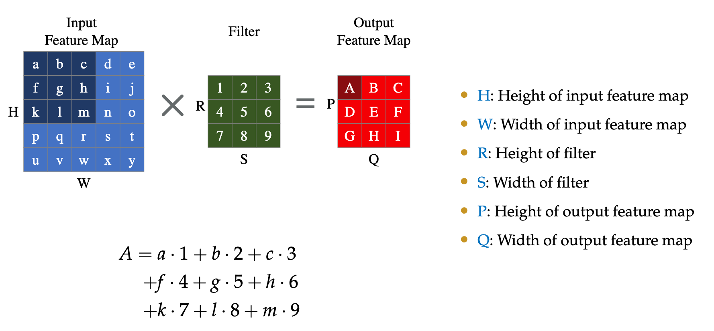

# 02 GEMM 
啊啊啊我好像不知道什么是GEMM啊

好像全名是General Matrix Multiplication

## Convolution Basis

这算是卷积计算的基本流程，显然通过AI引论的学习，我们对这个是*深知于心*的（doge）

其中有一点可以注意：
$$
P = \frac{H - R}{\Bbb{stride}} + 1
$$
$$
Q = \frac{W - S}{stride} + 1
$$

然后，如果我们要补零的话，那么在分子上添加$2 \cdot pad$即可，同样，$pad$的值也可以这么来计算。

我们继续讨论不是简单的2D的情况，我们讨论3D的情况

嗯嗯，差不多3D的情况是这样的，通常来说我们或许只使用一个Filter，但是使用多个Filter也不是不可以。

ok，这就是传统卷积网络的计算过程，但是我们回到这种计算本身，我们其实发现他有很多问题：
- 低性能表现
- 内存访问模式不好，没有很好的利用局部性，尤其是空间局部性
- 很短的点积导致常数的固有开销不能很好的被分摊

*（谁懂我在早八之前刚看完ics的memory的ppt的救赎感啊）*

但是他讲了好多好多transistor的东西....我听不懂呜呜呜呜，但是感觉显然不是重点。

## Im2Col

我们研究上面这张图片，我们很容易就能发现他把原来的卷积矩形变成了一个$1 \cdot D$的向量

这样转换之后我们就可以让他完美符合spatial locality ，但是我有疑问，这部转化和之前的直接乘相比，如果只处理一次的话，看起来似乎没有什么优势。

不对，这样似乎我们又扩大了我们的存储空间，所以我感觉似乎他应该对时间上有所优化....对，这样似乎还可以再去开多线程计算，是一个很好的办法。。。

对于多个维度的情况，我们也可以通过矩阵凭借的方法让他产生最终的特征图。

讨论三维然后配多个卷积层，格式如下图所述：

那个$d$是一个平面上的输出的数量

## Memory-efficient Convolution

我们刚刚提到了一个很重要的问题，在这个转换的过程中，有很多元素会被重复访问，我们这是或许就可以尝试一些优化手段来优化我们的转化手段。

研究这幅图片：

我们先转化每三列，然后我们在转化的过程中我们再去截取，就可以获得这些我们需要的行向量，这样我们就把原始数据内的每个数的复制次数从$n^2$优化到了$n$.

对于内存占用对比，MEC的内存占用几乎是2x的优化。

## Memory Layout

### NCHW Memoru Layout
先按每个channel存，然后再按每个H存，Just like this：

### NHWC Memory Layout
每个单元存各个channnel，具体如图所示：

教授突然不知道为什么开始讲流水线了，有点迷惑，不会真的这么巧吧...前天刚看完流水线ppt今天就讲这个.....

